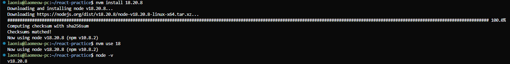
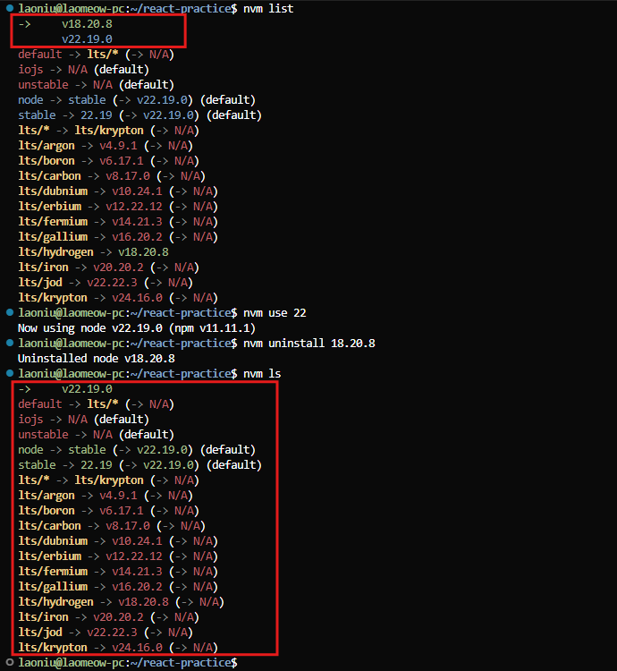
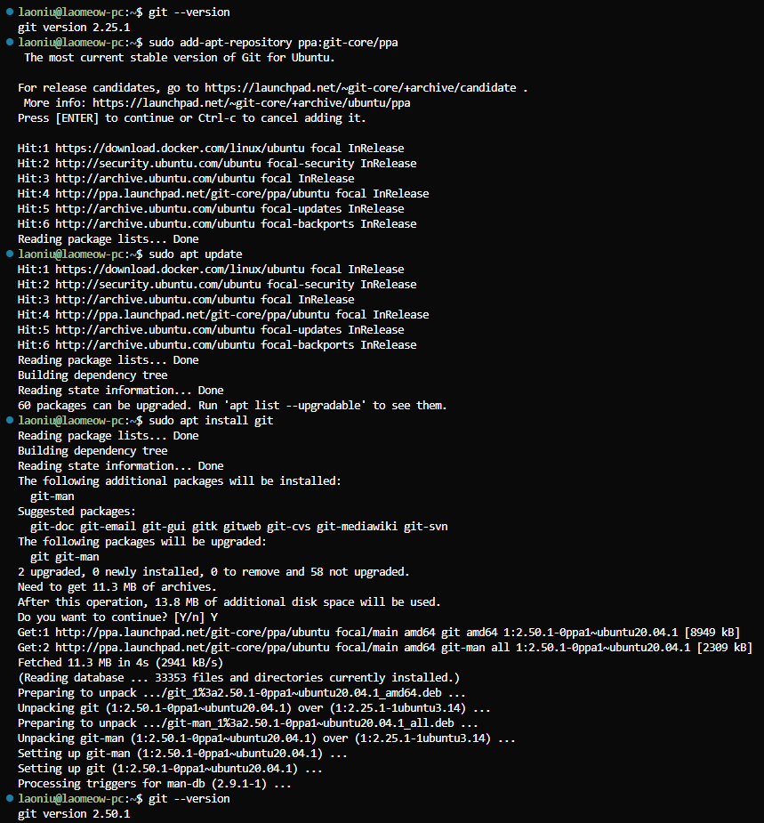
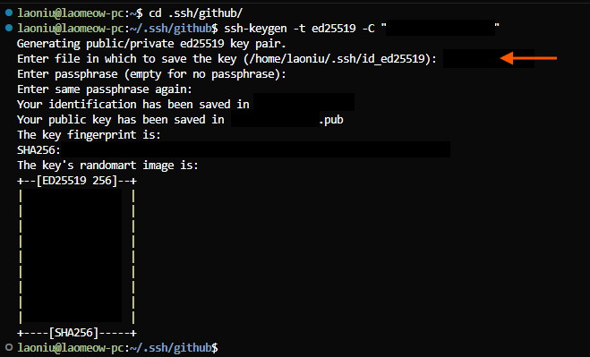
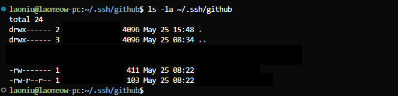
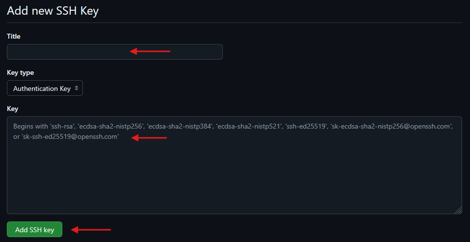
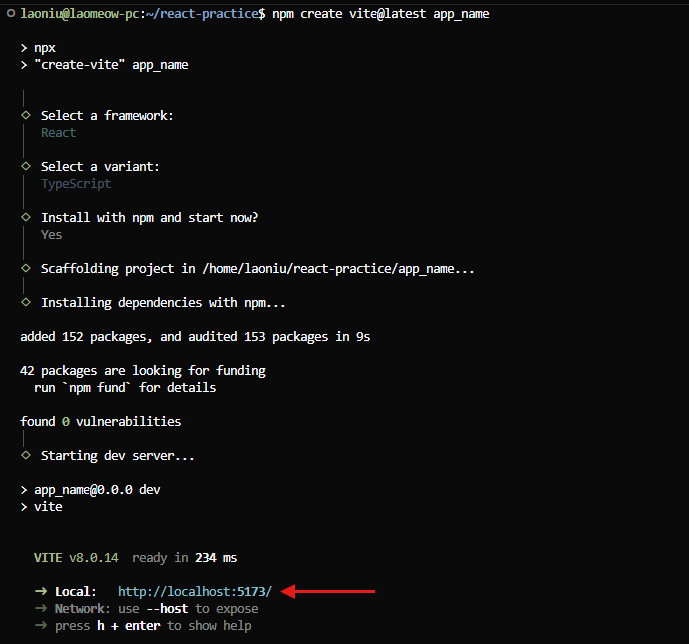
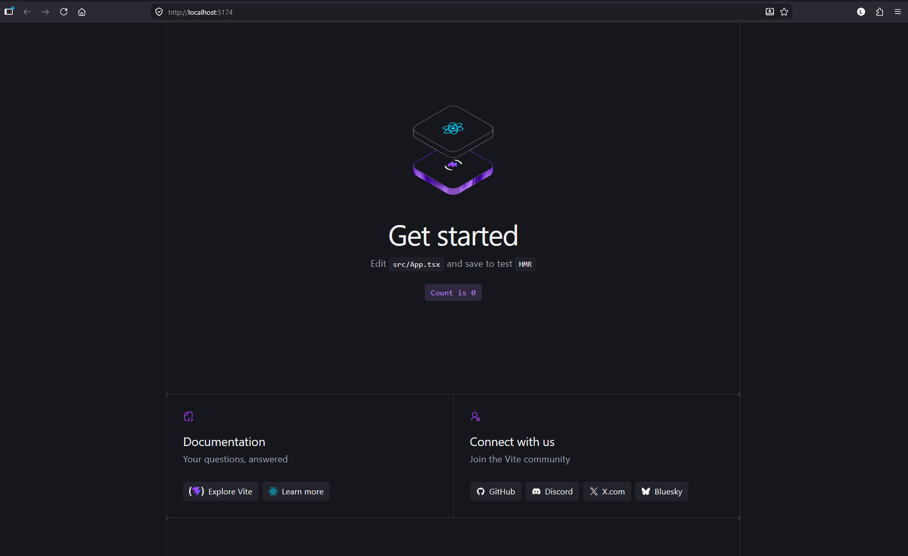
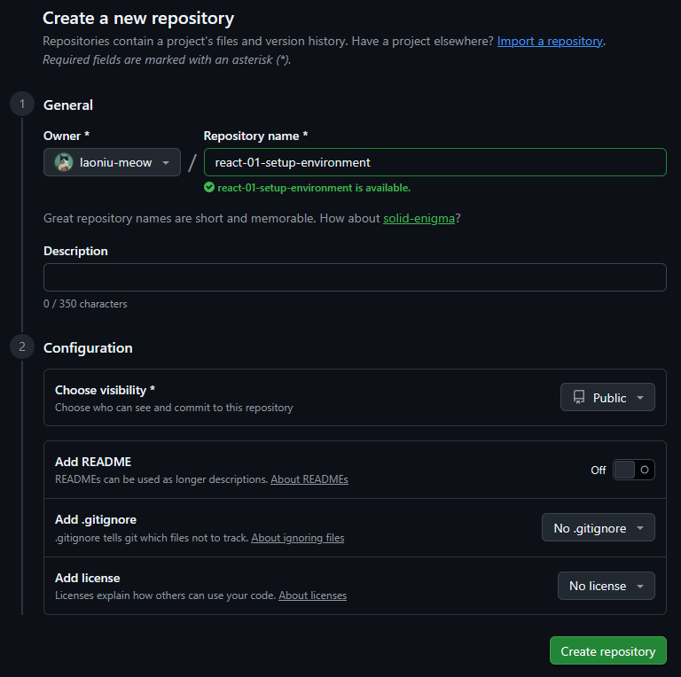

# Setup the Develpment Environment and Create a Startup App

## Topics
```
1. Install Node.js
2. Setting up a GitHub Account and Configuration in WSL environment / Linux OS
3. Create Basic App with React + Vite + TranScript 
4. Commit the repository to GitHub
```

## Install Node.js
Node.js is a runtime that lets you run JavaScript outside the browser

### Why you need it

You install Node.js mainly to:
- Run frontend tools like React, Vite, Next.js
- Use npm to install packages (libraries)
- Start a development server (npm run dev)
- Build and manage modern web apps

In simple terms
- Browser runs JavaScript for UI
- Node.js runs JavaScript for development tools and backend


### Verify Node version

```bash
node -v

# Output version:
v22.19.0
```

### Install a Specific Node.js Version
In a real working environment, most development teams do not use the latest version until it has been tested and approved for upgrade. Therefore, we must also know how to install a specific Node.js version to align with the team’s setup

Example: The teams required to use 18.20.8

```bash
# 1. Check current Node.js version
node - v

# 2. Download and install NVM
curl -o- https://raw.githubusercontent.com/nvm-sh/nvm/master/install.sh | bash

# 3. Reload Your Shell
source ~/.bashrc

# 4. List version
nvm ls-remote

# 5. Install a Specific Node.js Version
nvm install 18.20.8

# 6. Use a Specific Node.js Version
nvm use 18

# 7. Verify the active version
node -v

# 8. Set a Specific Version as Default
nvm alias default 18
```

Output of intall specific Node.js:



---

### Install and use latest Node.js version
If Node.js is not installed, install the latest Node.js and use the LTS version for your environment

```bash
# 1. Download and install NVM
curl -o- https://raw.githubusercontent.com/nvm-sh/nvm/master/install.sh | bash

# 2. Reload Your Shell
source ~/.bashrc

# 3. Install the Latest Node.js LTS Version
nvm install --lts

# 4. Set the LTS Version as Default
nvm alias default lts/*
```

---

### Additional Information - Uninstall Node.js version

```bash
# 1. Check the installed version
nvm list 

# 2. Changed use version
nvm use <version>

# 3. Remove Node version
nvm uninstall <version>

# 4. nvm uninstall 18.20.8
nvm ls
```

Output of the remove version:



---

## Setting up a GitHub Account and Configuration in WSL environment / Linux OS
GitHub is a web-based platform used for storing, managing, and collaborating on code using Git version control. It is widely used by developers and teams to build software projects efficiently.

Why use GitHub (Key points):
- Version control: Tracks changes in code and allows easy rollback to previous versions.
- Collaboration: Supports multiple developers working on the same project without conflicts.
- Backup & safety: Stores projects online, preventing data loss.
- Organization: Uses tools like branches and pull requests to manage work properly.
- Code review: Helps improve code quality through team feedback before merging.
- Learning & sharing: Provides access to open-source projects and portfolio building.
- Industry use: Commonly used in real-world software development teams.


### 1. Create a GitHub Account
<ol type="a">
<li>Go to https://github.com</li>
<li>Click Sign up</li>
<li>Enter:</li>
   <ul>
      <li>Email address (recommended to use one you’ll keep long-term)</li>
      <li>Password</li>
      <li>Username (this becomes your public GitHub identity)</li>
      <li>Verify email and complete onboarding</li>
      <li>Optional: Recommended to enable Passkey and Multi-factor Authentication (MFA)</li>
   <ul>
</ol>

### 2. Check Git Version

```bash
git --version

# Output Git Version
git version 2.25.1.
```

### Install Git if not exist in your environment

```bash
# 1. Update system packages
apt update && sudo apt upgrade -y

# 2. Install Git
apt install git -y

# 3. Verify version after installation
git --version

```
### Update Git verion

```bash
# 1. Adds the official Git Core Team PPA to your Ubuntu system
sudo add-apt-repository ppa:git-core/ppa

# 2. Update the current environment
sudo apt update

# 3. Install and update git
sudo apt install git

# 4. Verify version after update
git --version
```

Output of the update git:




### 3. Basic Git Configuration for (Multiple Git Account)
Using multiple Git accounts is common in software development environments. This practice helps separate work and personal projects, improving organization and security rather than adding complexity.

a. Set your identity

```bash
git config --global user.name "Your Name"
git config --global user.email "your-email@example.com"
```

b. Confirm settings

```bash
git config --global --list

# Output:
user.name=<your username>
user.email=<your email>
```

### 4. Set Up Authentication to GitHub
```bash
# 1. Create and organize the key pair in the relevant folders
mkdir -p .ssh/github

# 2. Secure main .ssh directory
chmod 700 ~/.ssh

# 3. Secure the github subdirectory
chmod 700 ~/.ssh/github

# 4. Navigate to the directory
cd .ssh/github

# 5. Generate SSH Key
ssh-keygen -t ed25519 -C "your-email@example.com"
```

Output of generate SSH key:



```bash
# 6. Secure the generated key files
# Private key
chmod 600 ~/.ssh/github/<key filename>

# Public key
chmod 644 ~/.ssh/github/<key filename>.pub

# 7. Verify Permissions
ls -la ~/.ssh/github

```
Output of directory and files permission:



```bash
# 8. Start SSH agent
eval "$(ssh-agent -s)"

# 9. Add SSH key
ssh-add ~/.ssh/<key filename>  # <-- the key filename

# 10. Copy public key
cat ~/.ssh/<key filename>.pub

# 11. Then go to GitHub:
# 11 (a) Settings
# 11 (b) SSH and GPG Keys
# 11 (c) New SSH Key
# 11 (d) Give a title
# 11 (e) Paste key
# 11 (f) Click on "Add SSH Key"
```
Output of directory and files permission:



```bash
# 12. Configure SSH to use this key. If you have multiple accounts, use this template to add more
nano ~/.ssh/config

# Add ssh config
Host github.com            # <- host name
    HostName github.com
    User git
    IdentityFile ~/.ssh/github/<key filename>

# 13. Secure config
chmod 600 ~/.ssh/config

# 14. Test Connection
ssh -T git@github.com   # <- host name
```

---

## Create Basic App with React + Vite + TranScript 

```bash
# Optional: I like to keep my projects in relevant folders and organize them more neatly. So I will use the mkdir command to create a new directory, then use cd <directory> to navigate into the specific folder, and finally execute the command to create the app

# 1. Create app with Vite
npm create vite@lastes <app_name> 
# or
npm create vite@5.0.0 <app_name>

# 2. Move the arrow button up or down to selectSelect a framework:
-> React

# 3. Select a varaint:
-> TypeScript

# 4. Install with npm and start now?
-> Yes
```

Once the scaffolding is completed, press Ctrl + Click the Url to open and run the app





---

## Commit the repository to GitHub
1. Create a repo on GitHub
- Go to https://github.com
- Click New repository
- Give it a name (e.g., react-01-setup-environment)
- Do NOT initialize with README (important if you already have local files)
- Click Create repository



```bash
# 2.  Navigate to the directory that contains the .git folder (the root of your project repository)
# Example:
# react-practice/                      ← root directory
#    └── react-01-setup-environment/   ← subdirectory - project repository

cd react-pratice/react-01-setup-environment/
```

```bash
# 3. Initialize Git (only once per project)
git init

# 4. Connect to the remote repository - Please take note that if you have multiple GitHub accounts, the commands may be slightly different
# Single account in your environment
git remote add origin <remote-repo-URL>      # defer to the url in the GitHub

# Having multiple account and in the config file hostname: github-laoniu
# Sample Config file:
# Add ssh config
# Host github.com            # <- host name
#     HostName github.com
#     User git
#     IdentityFile ~/.ssh/github/<key filename>

git remote add origin git@<hostname>:<git username>/<repository>.git
# Example: git remote add origin git@github-laoniu:laoniu-meow/react-01-setup-environment.git

# 5. Check the connected to remote repository
git remote -v

# 6. Check status
git status

# 7. Add git branch - main
git branch -M main

# 8. Check branch
git branch

# 9. Stage your changes
git add .

# 10. Commit changes
git commit -m 'Add your commit message'

# 11. Push code to remote repository
git push -u origin main
```